# Computer Vision Pipeline Specification

**Product**: Cubyntra  
**Organization**: Necookie Labs  
**Document Version**: 1.0  
**Status**: V1 Release  
**Last Updated**: 2026-09-26  

---

## 1. Computer Vision Overview
Cubyntra features a 100% client-side, privacy-first computer vision pipeline capable of running in standard browser sandboxes without WebAssembly overhead or server-side vision APIs. The perceptual pipeline transforms raw WebRTC video frames into a discrete 54-facelet physical cube model with high confidence and resilience to ambient illumination shifts.

```mermaid
flowchart LR
    Frame[Camera Frame] --> ROI[Square ROI Reticle]
    ROI --> Grid[3x3 Sampling Grid]
    Grid --> Trim[Trimmed-Mean Aggregation]
    Trim --> Spaces[sRGB -> HSV & CIELAB]
    Spaces --> Classify[Hybrid Metric Classifier]
    Classify --> Conf[Confidence Calculation]
    Conf --> Buffer[Temporal Stability Buffer]
    Buffer --> Capture[Face Capture Matrix]
```



---

## 2. Why Raw RGB Is Insufficient
Relying on raw RGB Euclidean distance is one of the most common failure modes in computer vision cube scanners:
1. **Intensity Non-Linearity**: A blue sticker under bright sunlight has higher R, G, and B channel values than a white sticker under dim room lighting.
2. **Perceptual Non-Uniformity**: The human visual system perceives chromatic differences non-linearly (MacAdam ellipses). In RGB space, equal Euclidean distances do not correspond to equal perceptual differences.
3. **Specular Glare**: Plastic stickers reflect concentrated point-light sources (phone flashes, ceiling bulbs), saturating all three channels $(255, 255, 255)$ regardless of underlying plastic pigment.
4. **Color Cast / White Balance**: Incandescent lighting shifts whites and yellows towards orange/red; cool fluorescent lighting shifts greens towards blue.

To resolve these challenges, Cubyntra employs a dual-space transformation ($sRGB \to HSV$ and $sRGB \to CIELAB$) combined with center-sticker calibration.

---

## 3. Mathematical Color Space Transformations

### 3.1 RGB to HSV Conversion
Given normalized color components $r, g, b \in [0, 1]$ where $r = R/255, g = G/255, b = B/255$:

$$C_{\max} = \max(r, g, b), \quad C_{\min} = \min(r, g, b), \quad \Delta = C_{\max} - C_{\min}$$

**Hue ($H \in [0^\circ, 360^\circ)$):**
$$
H = \begin{cases}
0^\circ & \text{if } \Delta = 0 \\
60^\circ \times \left(\frac{g - b}{\Delta} \pmod 6\right) & \text{if } C_{\max} = r \\
60^\circ \times \left(\frac{b - r}{\Delta} + 2\right) & \text{if } C_{\max} = g \\
60^\circ \times \left(\frac{r - g}{\Delta} + 4\right) & \text{if } C_{\max} = b
\end{cases}
$$

**Saturation ($S \in [0\%, 100\%]$):**
$$
S = \begin{cases}
0\% & \text{if } C_{\max} = 0 \\
\frac{\Delta}{C_{\max}} \times 100\% & \text{if } C_{\max} > 0
\end{cases}
$$

**Value ($V \in [0\%, 100\%]$):**
$$V = C_{\max} \times 100\%$$

---

### 3.2 RGB to CIELAB Conversion
1. **Gamma Expansion (sRGB to linear RGB):**
$$
c_{\text{linear}} = \begin{cases}
\frac{c}{12.92} & \text{if } c \le 0.04045 \\
\left(\frac{c + 0.055}{1.055}\right)^{2.4} & \text{if } c > 0.04045
\end{cases}
\quad \text{for } c \in \{r, g, b\}
$$

2. **Linear RGB to CIE XYZ (under D65 standard illuminant):**
$$
\begin{bmatrix} X \\ Y \\ Z \end{bmatrix} =
\begin{bmatrix}
0.4124564 & 0.3575761 & 0.1804375 \\
0.2126729 & 0.7151522 & 0.0721750 \\
0.0193339 & 0.1191920 & 0.9503041
\end{bmatrix}
\begin{bmatrix} r_{\text{linear}} \\ g_{\text{linear}} \\ b_{\text{linear}} \end{bmatrix}
$$

3. **XYZ to CIELAB ($X_n = 0.95047, Y_n = 1.00000, Z_n = 1.08883$):**
$$
L^* = 116 f(Y / Y_n) - 16, \quad
a^* = 500 [f(X / X_n) - f(Y / Y_n)], \quad
b^* = 200 [f(Y / Y_n) - f(Z / Z_n)]
$$
where:
$$
f(t) = \begin{cases}
t^{1/3} & \text{if } t > 0.008856 \\
7.787 t + \frac{16}{116} & \text{if } t \le 0.008856
\end{cases}
$$

4. **CIE76 Color Difference ($\Delta E$):**
$$\Delta E_{ab}^* = \sqrt{(L_1^* - L_2^*)^2 + (a_1^* - a_2^*)^2 + (b_1^* - b_2^*)^2}$$

---

## 4. Sampling Strategy & Outlier Rejection

```
+-----------------------------------+
|            Cell (s x s)           |
|   +---------------------------+   |
|   |   Inner Sample Sub-Region |   |
|   |   (width = 0.40 * s)      |   |
|   |                           |   |
|   |   Discard top/bottom 15%  |   |
|   |   Trimmed Mean:           |   |
|   |   R_agg, G_agg, B_agg     |   |
|   +---------------------------+   |
|   Avoids black plastic borders    |
+-----------------------------------+
```

### Trimmed-Mean Aggregation Algorithm
1. Extract all pixel triplets $\{p_1, p_2, \dots, p_N\}$ from the inner central 40% box of cell $(row, col)$.
2. Sort red, green, and blue values independently:
   $$R_{\text{sorted}} = \text{sort}(\{p_i.r\}), \quad G_{\text{sorted}} = \text{sort}(\{p_i.g\}), \quad B_{\text{sorted}} = \text{sort}(\{p_i.b\})$$
3. Compute trim offset $k = \lfloor N \times 0.15 \rfloor$.
4. Calculate mean exclusively over the central interval $[k, N - k]$:
   $$\bar{R} = \frac{1}{N - 2k} \sum_{i=k}^{N-k-1} R_{\text{sorted}}[i]$$

This rejects specular reflection spikes (which cluster in the top 10% highest brightness values) and boundary shadow/gaps (which cluster in the bottom 10%).

---

## 5. Color Classification Rules & Heuristics

Reference plastic centroid coordinates in CIELAB space:
- **White**: $L^*=92, a^*=0, b^*=2$
- **Yellow**: $L^*=85, a^*=-8, b^*=85$
- **Green**: $L^*=56, a^*=-55, b^*=35$
- **Blue**: $L^*=32, a^*=15, b^*=-60$
- **Red**: $L^*=45, a^*=65, b^*=45$
- **Orange**: $L^*=62, a^*=50, b^*=65$

### HSV Boundary Thresholds:
- **White Detection**: Low saturation ($S < 22\%$ or $S < 30\%$ when $V > 70\%$). High lightness ($L^* > 70$).
- **Yellow Detection**: Hue $H \in [42^\circ, 75^\circ]$, $S \ge 35\%$, $V \ge 45\%$, and strongly positive $b^* > 20$.
- **Green Detection**: Hue $H \in [80^\circ, 168^\circ]$, $S \ge 28\%$, and strongly negative $a^* < -10$.
- **Blue Detection**: Hue $H \in [175^\circ, 265^\circ]$, $S \ge 30\%$, and strongly negative $b^* < -10$.
- **Orange Detection**: Hue $H \in [12^\circ, 42^\circ)$, $S \ge 40\%$, positive $a^* > 10$, and positive $b^* > 20$.
- **Red Detection**: Hue wrap-around $H \in [0^\circ, 12^\circ) \cup [340^\circ, 360^\circ]$, $S \ge 40\%$, and high positive $a^* > 25$.

---

## 6. Confidence Scoring
For each sticker sample, candidate scores $\{S_{\text{white}}, S_{\text{yellow}}, S_{\text{green}}, S_{\text{blue}}, S_{\text{red}}, S_{\text{orange}}\}$ are calculated. The candidates are ranked in descending order:

$$S_{(1)} \ge S_{(2)} \ge \dots \ge S_{(6)}$$

Confidence $C \in [0.0, 1.0]$ is computed as the normalized margin between the best candidate $S_{(1)}$ and the runner-up $S_{(2)}$:

$$C = \min\left(1.0, \max\left(0.20, \frac{S_{(1)} - S_{(2)}}{45}\right)\right)$$

A high confidence score ($C > 0.85$) indicates clear, unambiguous color identity; a low score ($C < 0.60$) indicates boundary ambiguity (typically between orange and red or white and faded yellow).

---

## 7. Temporal Stability Buffer
Cubyntra never captures based on an isolated frame. The `TemporalStabilityBuffer`:
1. Maintains a rolling window of recent frame classifications ($N = 15$).
2. Compares all 9 sticker predictions with the immediate previous frame.
3. If all 9 stickers match and average confidence $\ge 0.70$, increments consecutive match counter.
4. Requires $M = 8$ consecutive matching frames before asserting `isStable: true` (Stability Progress = 100%).
5. Fluctuations decay the counter by 2, preventing accidental captures during motion.

---

## 8. Failure Modes & Mitigations

| Failure Mode | Root Cause | System Mitigation |
| :--- | :--- | :--- |
| **Specular Glare** | Overhead light bulb reflection saturating pixels | Trimmed-mean aggregation discards top 15% brightest outliers. |
| **Orange / Red Ambiguity** | Warm incandescent light shifting red into yellow-orange | CIELAB $a^*$ (green-red) and $b^*$ (blue-yellow) dual metric weighting. |
| **White / Yellow Ambiguity** | Dim warm lighting causing white stickers to appear yellow | Saturation gating: Yellow requires $S > 35\%$; white requires $S < 25\%$. |
| **Hand Tremor / Motion Blur** | Moving cube while holding in front of camera | Temporal stability buffer requiring 8 consecutive identical frames. |

---

## 9. Benchmark Status
- Synthetic Color Space Unit Tests: **PASSED (11/11 tests)**
- Hardware-specific physical lighting field benchmarks: **NOT YET BENCHMARKED** (empirical multi-camera lighting trials are planned for V1.x).
