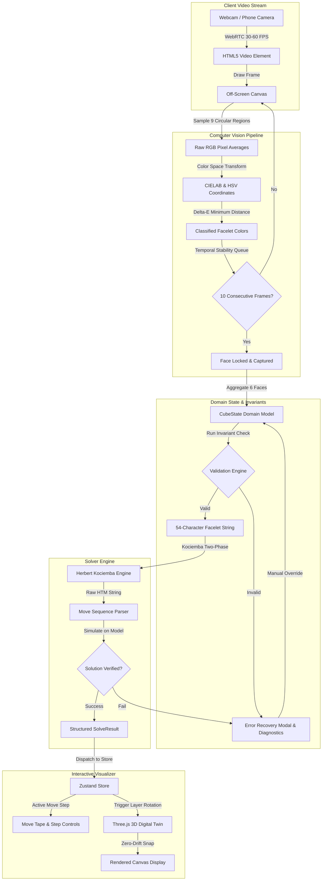

# Cubyntra Data Flow Architecture

**Product**: Cubyntra  
**Organization**: Necookie Labs  
**Status**: Implemented  
**Scope**: End-to-End System Data Lifecycle

---

## 1. System-Wide Data Flow Pipeline



---

## 2. Computer Vision Data Flow

1. **Frame Capture**: Off-screen `HTMLCanvasElement` renders current video frame every `requestAnimationFrame` tick.
2. **Normalized Grid Sampling**: 9 coordinates $(u_i, v_j) \in [0, 1] \times [0, 1]$ mapped to canvas pixel dimensions. Circular kernel radius $R = 8\text{px}$ averages interior pixels to eliminate sensor noise.
3. **Perceptual Classification**:
   $$E_{\text{distance}} = \sqrt{(L_1 - L_2)^2 + (a_1 - a_2)^2 + (b_1 - b_2)^2}$$
   Reference swatches are calibrated to standard competition cube shades.
4. **Temporal Stability Queue**: A sliding window of size $N = 10$. If all 9 sample cells yield identical classifications across $N$ consecutive frames, the face state transitions from `UNSTABLE` to `LOCKED`.

---

## 3. Mathematical State Validation Flow

The 6-face data structure undergoes four sequential verification filters:

```
Raw Face Captures [U, D, F, B, L, R]
               │
               ▼
[ 1. Cardinality Filter ] ── Fail ──► Reject (Sticker count != 9 per color)
               │ Pass
               ▼
[ 2. Physical Piece Integrity ] ── Fail ──► Reject (Impossible edge/corner pairs)
               │ Pass
               ▼
[ 3. Permutation Parity ] ── Fail ──► Reject (Odd edge/corner swap parity)
               │ Pass
               ▼
[ 4. Group Orientation Parity ] ── Fail ──► Reject (Edge flip != 0 mod 2, Twist != 0 mod 3)
               │ Pass
               ▼
Output Validated 54-Facelet String
```

---

## 4. State Management & 3D Synchronization

The centralized Zustand store (`src/stores/useCubyntraStore.ts`) broadcasts state updates to both DOM components and the Three.js rendering loop:

- **State Dispatches**:
  - `captureFace(face, grid)`: Advances scanner step, updates face cache.
  - `solveCurrentState()`: Invokes solver, stores move array, resets playback counter to 0.
  - `nextStep()` / `prevStep()`: Updates `currentStepIndex`, triggering Three.js layer animations.
- **Three.js Synchronization**:
  - The 3D engine subscribes to `currentStepIndex`.
  - When the index increments, the engine isolates the target slice, attaches cubies to the pivot group, interpolates rotation by $90^\circ$ or $180^\circ$, reparents to scene, and snaps transforms to exact integer coordinates.
  - Directional 3D arrows update position and rotation sense immediately.
