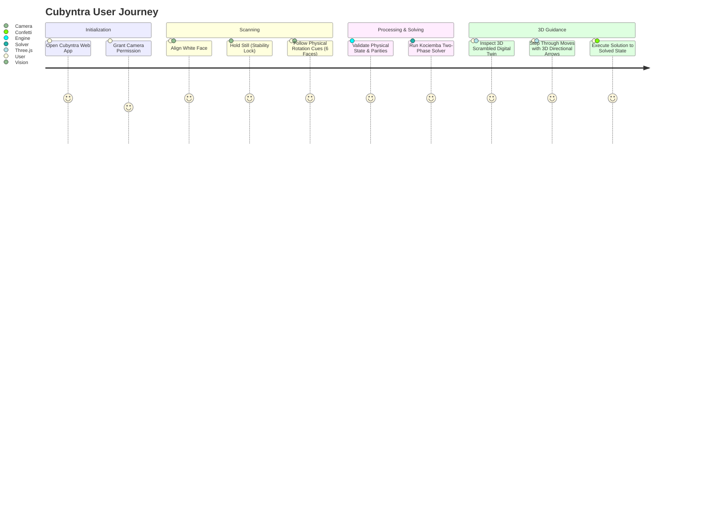

# Product Requirements Document (PRD)

**Product**: Cubyntra  
**Organization**: Necookie Labs  
**Tagline**: *See it. Solve it.*  
**Document Version**: 1.0  
**Status**: V1 Release  
**Last Updated**: 2026-09-26  

---

## 1. Product Overview
**Cubyntra** is a high-precision, web-based Computer Vision Rubik's Cube scanner, state validator, solver, and interactive 3D digital twin. Developed by **Necookie Labs**, Cubyntra enables any user with a standard camera-enabled device (smartphone, laptop, or desktop webcam) to scan a scrambled physical 3×3 Rubik's Cube, receive immediate mathematical validation, calculate an efficient solution sequence using Herbert Kociemba's two-phase algorithm, and follow intuitive 3D animated step-by-step guidance.

Cubyntra runs **100% on the client side**: no video streams or image data ever leave the user's browser, guaranteeing absolute privacy.

---

## 2. Product Vision
To create the most seamless, privacy-respecting, and mathematically rigorous physical-to-digital puzzle solving experience on the web. Cubyntra bridges physical reality with digital twin computation, laying the architectural groundwork for future autonomous physical robotics.

---

## 3. Problem Statement
The standard $3 \times 3 \times 3$ Rubik's Cube has $43,252,003,274,489,856,000$ possible permutations. While deterministic algorithms exist to solve any valid state, everyday users face major friction points:
1. **Manual Color Entry is Tedious & Error-Prone**: Entering 54 individual facelet colors manually takes 3–5 minutes and frequently suffers from typos that make the cube unsolvable.
2. **Cloud-Based Solvers Violate Privacy**: Existing scanning tools upload webcam frames to external servers or cloud vision APIs.
3. **Abstract Move Notation Confuses Beginners**: Standard Singmaster notation ($R, U', F2$) lacks intuitive visual orientation cues, leading users to execute wrong turns.
4. **Physical Cube Errors Go Unexplained**: If a cube has an internally twisted corner, flipped edge, or swapped stickers, typical solvers simply crash with generic "Invalid Cube" messages without diagnosing what is wrong.

---

## 4. Target Users
- **Novice Puzzle Solvers**: Individuals who scrambled their cube and need clear, step-by-step 3D visual guidance to restore it.
- **Speedcubers & Enthusiasts**: Cubers looking for efficient move sequences (HTM metric) and reconstruction diagnostics.
- **STEM Educators & Students**: Learners exploring group theory, computer vision, and coordinate geometry.
- **Robotics Engineers**: Developers seeking a solid algorithmic and perceptual foundation for physical cube manipulation mechanisms.

---

## 5. User Needs
- Fast, guided scanning that does not require tedious manual input.
- Real-time feedback on whether a face is aligned and stable.
- Complete privacy protection (no video uploads).
- Clear, unambiguous 3D layer animations and directional arrows showing exactly how to turn each layer.
- Granular error diagnostics explaining specifically which face or piece has an issue.

---

## 6. Product Goals
1. Deliver sub-second physical cube state reconstruction from a guided 6-face sequence.
2. Execute Kociemba's two-phase algorithm client-side, returning solutions averaging 18–22 moves.
3. Render an interactive 3D digital twin with zero floating-point rotational drift.
4. Maintain zero cloud dependencies: 100% local processing.
5. Provide accessible, responsive interfaces across desktop, tablet, and mobile browsers.

---

## 7. Non-Goals (V1)
- Physical motor or servo control (ESP32 / Arduino hardware).
- User authentication, accounts, or persistent cloud databases.
- Multi-puzzle support ($4\times4, 2\times2$, Pyraminx).
- Automated unguided free-form 3D object tracking without reticle alignment.

---

## 8. Scope Categorization (MoSCoW)

### MUST HAVE (V1)
- WebRTC camera feed with rear/environment camera preference.
- 3×3 square reticle target with perspective-safe ROI.
- Trimmed-mean pixel aggregation and HSV/CIELAB color classification.
- Temporal stability buffer requiring consecutive stable frames before capture.
- Guided 6-face capture sequence (U, F, R, B, L, D) with physical rotation hints.
- Strict state validation: 54 stickers, 9 of each color, 6 canonical centers, corner twist parity, edge flip parity, and permutation parity.
- Client-side Herbert Kociemba two-phase solver.
- Interactive 3D Rubik's cube with 27 cubies.
- Zero-drift layer rotation animations with orthogonal matrix snapping.
- 3D directional curved move arrows.
- Full playback controls (Play, Pause, Step Next, Step Previous, Reset to Scramble, Speed selector).
- Real-time Computer Vision Debugger inspection panel.
- Fallback simulated scramble demo for camera-less environments.

### SHOULD HAVE (V1.x)
- Manual sticker color correction override prior to solving.
- Audio cues for frame capture and move execution.
- Auto-capture toggle settings in preferences.

### COULD HAVE (V2)
- Real-time move verification via live webcam stream.
- Web Worker multithreading for table generation.

### OUT OF SCOPE (V1)
- *FUTURE / OUT OF SCOPE FOR V1*: ESP32 microcontrollers, stepper motors, servo drivers, robotic grippers, and physical chassis.

---

## 9. User Stories
- **US-01 (Scanning)**: As a user, I want the camera viewfinder to guide me through holding each face in a clear sequence so that all 54 stickers are accurately digitized.
- **US-02 (Stability)**: As a user, I want a visual progress bar indicating when the cube is held steady enough to be captured so that motion blur does not cause misclassifications.
- **US-03 (Validation)**: As a user, I want instant validation that alerts me if a piece is physically impossible so that I can rescan only the problematic face without starting over.
- **US-04 (Solving)**: As a user, I want an efficient move sequence generated in milliseconds without having my camera data uploaded to any server.
- **US-05 (3D Guidance)**: As a user, I want to see the digital twin rotate the exact layers with 3D directional arrows so that I know exactly which face and direction to turn on my physical cube.
- **US-06 (Playback)**: As a user, I want to step forward, backward, pause, or auto-play through the solution at varying speeds.

---

## 10. User Journey

---

## 11. Functional Requirements
- **FR-CAM-001**: Application shall request camera permissions with rear/environment preference.
- **FR-CV-001**: Application shall sample 9 distinct sticker sub-regions inside a defined central ROI.
- **FR-CV-002**: Application shall aggregate pixel values using trimmed mean to reject specular glare.
- **FR-CV-003**: Application shall classify colors into White, Yellow, Green, Blue, Red, Orange.
- **FR-CV-004**: Application shall require consecutive frame consensus before triggering stability lock.
- **FR-CUBE-001**: Application shall maintain an independent logical model of 54 facelets and 27 cubie coordinates.
- **FR-CUBE-002**: Application shall validate sticker counts, centers, edge flip parity, corner twist parity, and permutation parity.
- **FR-SOLVER-001**: Application shall execute Herbert Kociemba's two-phase algorithm client-side.
- **FR-SOLVER-002**: Application shall return Half Turn Metric (HTM) sequences verified against an internal simulation.
- **FR-3D-001**: Application shall construct an interactive 3D Rubik's cube twin.
- **FR-3D-002**: Application shall snap cubie positions and quaternions to orthogonal integer axes upon rotation completion.
- **FR-3D-003**: Application shall render 3D curved directional arrows pointing in turn directions.

---

## 12. Non-Functional Requirements
- **NFR-PERF-001**: Layer animation execution shall run at a consistent 60 FPS on supported hardware.
- **NFR-PERF-002**: Kociemba two-phase solve search shall return solutions in under 100ms on typical scrambles.
- **NFR-PRIV-001**: Zero image or video data shall leave the client device.
- **NFR-A11Y-001**: All controls shall be keyboard-navigable and respect `prefers-reduced-motion`.
- **NFR-REL-001**: Application shall gracefully handle camera denial or absence via synthetic scramble fallbacks.

---

## 13. Acceptance Criteria
1. When 6 valid faces are scanned or mock loaded, the solver generates a valid solution sequence.
2. Applying the solution sequence to the 3D cube results in all 6 monochrome faces.
3. Arbitrary rotations produce exactly 0.000% floating point drift.
4. An intentionally twisted corner or flipped edge produces a clear, actionable validation error.

---

## 14. Risks & Mitigations
| Risk | Severity | Mitigation |
| :--- | :--- | :--- |
| Heavy ambient lighting cast (yellow incandescent) | Medium | Center sticker white-balance calibration and CIELAB perceptual metrics |
| Motion blur during hand movement | High | Temporal stability buffer requiring consecutive identical frames |
| Browser camera permission denial | Medium | Informative UI with instant simulated scramble demo button |
| Floating-point matrix accumulation drift | High | Integer matrix and position snapping after every layer turn |

---

## 15. Future Robotics Expansion
*FUTURE / OUT OF SCOPE FOR V1*

Cubyntra's logical move abstraction (`CubeMove[]`) is designed to decouple algorithm generation from physical execution. In future versions (V3/V4), the same move array can be routed to an ESP32 hardware motor controller driving 6 stepper motors or a 2-gripper mechanism to physically solve cubes automatically.
