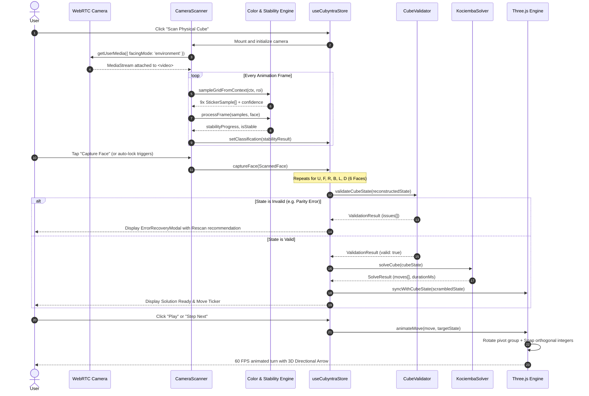
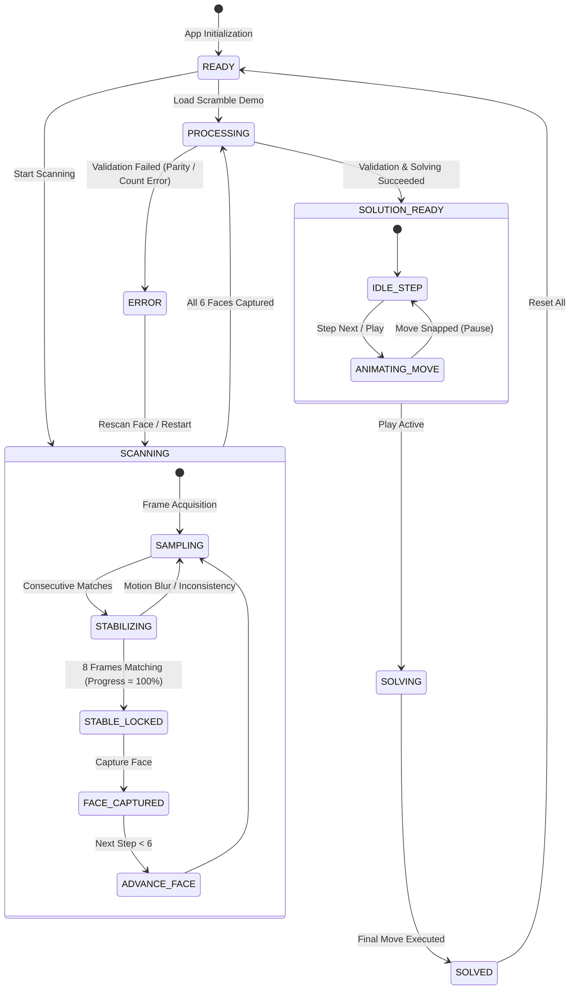

# System Design Document

**Product**: Cubyntra  
**Organization**: Necookie Labs  
**Document Version**: 1.0  
**Status**: V1 Release  
**Last Updated**: 2026-09-26  

---

## 1. System Overview & Component Responsibilities

The system is decomposed into five primary subsystems coordinated by a centralized Zustand store:

| Subsystem | Key Files | Primary Responsibilities |
| :--- | :--- | :--- |
| **Vision & Scanner** | `src/vision/camera.ts`<br>`src/vision/sampling.ts`<br>`src/vision/color.ts`<br>`src/vision/stability.ts` | MediaStream capture, centered ROI framing, 3x3 pixel aggregation with outlier rejection, HSV/CIELAB conversion, and multi-frame consensus buffering. |
| **Cube Domain** | `src/cube/types.ts`<br>`src/cube/constants.ts`<br>`src/cube/transforms.ts`<br>`src/cube/validator.ts` | Representation of the 54 facelets and 27 cubie coordinates, face rotations, move parsing/inversion, and parity validation. |
| **Solver Subsystem** | `src/solver/types.ts`<br>`src/solver/solver.ts` | Kociemba two-phase table lookups, move optimization, and simulation verification. |
| **3D Digital Twin** | `src/three/cubie.ts`<br>`src/three/arrows.ts`<br>`src/three/engine.ts`<br>`src/components/cube/CubeVisualizer.tsx` | WebGL scene lifecycle, lighting, camera controls, layer rotation animations, orthogonal matrix snapping, and 3D directional arrows. |
| **State & Presentation** | `src/stores/useCubyntraStore.ts`<br>`src/components/` | Application state machine, responsive dual-pane layout, move ticker, speed controls, and CV debugger telemetry. |

---

## 2. End-to-End Sequence Diagram



---

## 3. Scanning State Machine

The scanning lifecycle transitions through deterministic states managed by Zustand:



---

## 4. Domain Data Models & Interfaces

### 4.1 Cube Domain Model (`src/cube/types.ts`)
```ts
export type CubeColor = 'white' | 'yellow' | 'green' | 'blue' | 'red' | 'orange';
export type Face = 'U' | 'R' | 'F' | 'D' | 'L' | 'B';
export type QuarterTurns = 1 | -1 | 2;

export interface CubeMove {
  face: Face;
  quarterTurns: QuarterTurns;
  notation: string;
  description: string;
}

export type FaceStickers = [
  CubeColor, CubeColor, CubeColor,
  CubeColor, CubeColor, CubeColor,
  CubeColor, CubeColor, CubeColor
];

export interface CubeState {
  U: FaceStickers;
  R: FaceStickers;
  F: FaceStickers;
  D: FaceStickers;
  L: FaceStickers;
  B: FaceStickers;
}
```

### 4.2 Computer Vision Models (`src/vision/types.ts`)
```ts
export interface RGBColor { r: number; g: number; b: number; }
export interface HSVColor { h: number; s: number; v: number; }
export interface LABColor { l: number; a: number; b: number; }

export interface StickerSample {
  row: number;
  col: number;
  index: number;
  rgb: RGBColor;
  hsv: HSVColor;
  lab: LABColor;
  predictedColor: CubeColor;
  confidence: number;
  colorScores: Record<CubeColor, number>;
}

export interface FrameClassificationResult {
  stickers: StickerSample[];
  averageConfidence: number;
  isStable: boolean;
  stabilityProgress: number;
  stableFramesCount: number;
  expectedFace: Face;
}
```

---

## 5. Concurrency, Performance & Memory Management

### 5.1 Non-Blocking Sampling Loop
Video frames are extracted using `ctx.getImageData()` within a `requestAnimationFrame` loop. To keep CPU utilization under 15% on mobile devices:
- Only the 9 central sampling patches are extracted, rather than copying the entire video frame buffer.
- React state updates are throttled: store updates occur only on changes in classifications or stability progression.

### 5.2 WebGL Resource Disposal
When navigating away from the visualizer or unmounting:
- `cancelAnimationFrame` terminates all render loops.
- `mesh.geometry.dispose()` frees buffer geometries.
- `material.dispose()` frees shader programs and textures.
- `renderer.dispose()` releases the WebGL 2.0 rendering context.
- `track.stop()` releases hardware camera lenses.
